<div align="center">



<br/>

# Filam & Pillar Church Directory

[](https://filampillardirectory.streamlit.app/)
[](https://www.python.org/)
[](LICENSE)


**TL;DR — One sentence:** A login-gated Streamlit app that helps Filam and Pillar church staff search people, map households, track birthdays/events, and spot data-quality issues — without putting a public member portal on the internet.

**Why it matters:** Church directories are full of PII. Staff still need searchable, map-aware tools day to day. This app keeps the full experience behind email allowlist + password + one-time code, and can pull live data from a private Google Sheet so real member records never need to live in GitHub.

**[Open live app →](https://filampillardirectory.streamlit.app/)**


</div>

---

## What this is (in plain English)

Filam & Pillar staff get one place to:

1. **Find people** — table, card, and household views  
2. **See where households live** — map with background geocoding  
3. **Stay ahead of dates** — calendar, including children's birthdays from parent records  
4. **Check data health** — leadership insights and quality reporting  

There is **no public portal**. Opening the app shows login only. After sign-in, the admin directory loads.

---

## Why it's interesting / significant

| | |
|---|---|
| **Privacy by design** | Auth wall + OTP; production CSV / geocode cache stay gitignored |
| **Ops-ready data path** | Local CSV for simple runs, or private Google Sheets for live updates in production |
| **Staff workflow in one UI** | Directory + map + calendar + insights — not a spreadsheet scavenger hunt |
| **Deployable** | Streamlit Cloud + secrets sync + optional pre-geocode so maps work on first load |

---

## Features

| | Capability |
|---|---|
| Search | People directory — table, card, and household views |
| Map | Household (and church) markers with geocoding |
| Calendar | Events plus children's birthdays from parent records |
| Insights | Leadership views and data-quality reporting |

---

## Login flow

1. Open the [live app](https://filampillardirectory.streamlit.app/) (or `make dev`) — login screen only  
2. Enter an allowlisted church email + the shared staff password  
3. Click **Send verification code** — a 6-digit OTP is emailed **only to that address**  
4. Enter the code. Session ends on browser close or **Log out**  

### Credentials setup

Copy `admin_credentials.sample.toml` → `admin_credentials.toml` (gitignored), or run:

```bash
python scripts/setup_admin.py
```

Configure:

- **email1–email3** — allowlisted addresses that may sign in  
- **password** — shared staff password (plaintext in the local file)  
- **smtp.user** — Gmail sender for OTP mail  
- **smtp.app_password** — [Google App Password](https://myaccount.google.com/apppasswords) (2-Step Verification required)  

Legacy layout is also supported: `email1`–`email3` under `[credentials.usernames.filpilchurch]` and `app_password` under `[Gmail App Password]` or `[smtp]`.

---

## Quick start

```bash
make dev
```

App: `http://localhost:8501`

**Sample data (safe for development):**

```bash
export CHURCH_CSV_PATH=data/sample_directory.csv
make dev
```

If SMTP is not configured locally, the OTP can appear on screen in **dev mode only** (not on Streamlit Cloud).

---

## Data

Reads from **local CSV** (default) or **Google Sheets** (recommended for deployment).

| Source | Path / note |
|--------|-------------|
| Production CSV | `Filam_Pillar Church Directory - Main.csv` (gitignored — real PII) |
| Sample CSV | `data/sample_directory.csv` (fake records for dev) |
| Geocode cache | `geocode_cache.json` (gitignored) |

### Google Sheets (live updates)

Use a **private Google Sheet** as the source of truth. The app refetches every 5 minutes (configurable) and when staff click **Refresh data**. Member data stays out of GitHub.

**Sheet format:** Row 1 must use the same 15 column headers as `data/sample_directory.csv`. Optional `Age`, `Age_Group`, or `Birth_Year` columns enable the directory age-group filter (Below 13, 13–18, 18+, Seniors 65+). Booleans accept `TRUE`/`FALSE`, `Yes`/`No`, etc.

**Sheet ID** from the URL: `https://docs.google.com/spreadsheets/d/SHEET_ID/edit`

| Who | Permission | Why |
|-----|------------|-----|
| Trusted staff who edit the directory | Editor | Maintain records |
| App service account | **Viewer** | App reads via service account |

**Local + secrets:**

1. Place the service account JSON under `.streamlit/` (gitignored)  
2. Enable **Google Sheets API** on the GCP project  
3. Sync and run:

```bash
make sync-secrets   # writes .streamlit/secrets.toml
make dev-sheets     # also runs sync-secrets
```

**Streamlit Cloud:** Run `make sync-secrets`, paste `.streamlit/secrets.toml` into **App settings → Secrets**, reboot.

| Variable | Purpose |
|----------|---------|
| `CHURCH_DATA_SOURCE` | `csv` or `sheets` (auto-detects sheets if `CHURCH_SHEET_ID` is set) |
| `CHURCH_SHEET_ID` | Google Sheet ID |
| `CHURCH_SHEET_WORKSHEET` | Tab name (optional; defaults to first tab) |
| `CHURCH_SHEET_CACHE_TTL` | Seconds between auto-refresh (default `300`) |
| `GOOGLE_APPLICATION_CREDENTIALS` | Path to service account JSON (optional) |
| `CHURCH_GCP_SERVICE_ACCOUNT_JSON` | Inline service account JSON string |

### Clean the CSV

```bash
python scripts/clean_csv.py
python scripts/clean_csv.py --dry-run
```

### Geocoding

After sign-in, household and church addresses geocode **in the background** (~1s per new address). Directory / Calendar / Insights stay usable; the sidebar shows `Mapping addresses: X/Y…`.

1. Sign in — background geocoding starts  
2. Open **Household Map** when ready (partial maps appear as addresses finish)  
3. Use **Geocode all missing** under **Map tools** to force or retry  

For instant maps on Streamlit Cloud, embed `[geocode_cache]` in secrets via `make pregeocode` and `make sync-secrets`.

---

## Configuration

| Variable | Default |
|----------|---------|
| `CHURCH_CSV_PATH` | `Filam_Pillar Church Directory - Main.csv` |
| `CHURCH_GEOCODE_CACHE_PATH` | `geocode_cache.json` |

Streamlit secrets (see `.streamlit/secrets.toml.example`):

```toml
[auth]
email1 = "..."
email2 = "..."
email3 = "..."
password = "shared-staff-password"

[smtp]
user = "sender@gmail.com"
app_password = "xxxx xxxx xxxx xxxx"
```

---

## Tests

```bash
make test
```

---

## Deployment checklist

1. Push code — **do not** commit the real CSV, geocode cache, or credentials  
2. Live URL: [filampillardirectory.streamlit.app](https://filampillardirectory.streamlit.app/)  
3. `make sync-secrets` → paste full `.streamlit/secrets.toml` into Streamlit Cloud Secrets  
4. Optional map bootstrap: `make pregeocode` then `make pregeocode-secrets`  
5. Share the Google Sheet only with trusted staff + the service account  

Without a secrets geocode cache, the map fills in over a few minutes after sign-in while background geocoding runs.

---

## Project layout

```text
app.py              Entry point (login gate + admin routing)
auth.py             Email + password + OTP
data_source.py      CSV / Google Sheets loader
helpers.py          Cleaning, geocoding, events, filters
views/
  admin_views.py    Staff pages
  shared.py         CSS, calendar, charts
scripts/
  setup_admin.py    Credential generator
  pregeocode.py     Geocode cache for local or Cloud secrets
  clean_csv.py      CSV cleanup and audit
data/
  sample_directory.csv
```

---

<div align="center">

**[Live App](https://filampillardirectory.streamlit.app/)** · MIT License · Built with Streamlit

</div>
